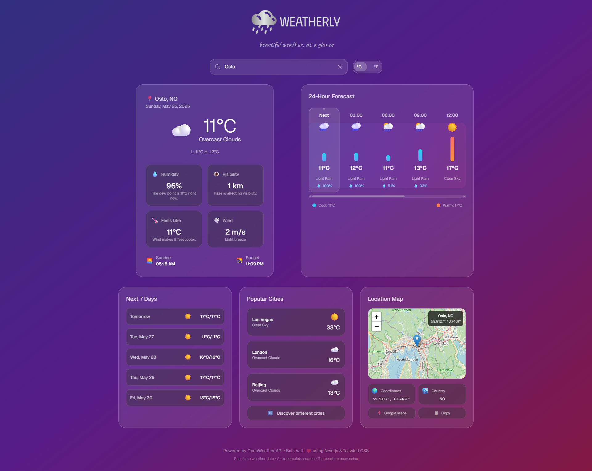

# 🌤️ Weatherly - Advanced Weather Application

A beautiful, responsive weather application built with Next.js, TypeScript, and Tailwind CSS. Features real-time weather data, interactive maps, intelligent city search, and a modern glass-morphism design.

<p align="center">
    
</p>

## ✨ Features

### 🔍 **Smart City Search**

- **Worldwide autocomplete**: Search any city globally using OpenWeatherMap's geocoding API
- **Intelligent suggestions**: Prioritizes major cities and exact matches
- **Duplicate prevention**: Advanced deduplication for cleaner results
- **Accessibility**: Full keyboard navigation and screen reader support

### 🌡️ **Temperature Controls**

- **Toggle switch design**: Modern switch-style temperature converter
- **Smooth transitions**: Visual feedback during unit conversion
- **Universal clickability**: Click anywhere on the toggle to switch

### 🗺️ **Interactive Location Map**

- **Real embedded maps**: OpenStreetMap integration (no API key required)
- **Location markers**: Precise positioning with city information
- **Quick actions**: Direct Google Maps links and coordinate copying
- **Responsive design**: Adapts to all screen sizes

### 📊 **Comprehensive Weather Data**

- **Current conditions**: Temperature, humidity, wind speed, visibility
- **24-hour forecast**: Timeline view with visual temperature bars
- **7-day forecast**: Extended weather predictions with proper alignment
- **Popular cities**: Randomized global weather showcase

### 🎨 **Modern UI/UX**

- **Glass morphism**: Elegant transparent design elements
- **Smooth animations**: Professional transitions and hover effects
- **Responsive layout**: Optimized for mobile, tablet, and desktop
- **Dark theme**: Beautiful gradient backgrounds

### ♿ **Accessibility Features**

- **ARIA labels**: Comprehensive screen reader support
- **Keyboard navigation**: Full keyboard accessibility
- **Focus management**: Proper focus indicators and management
- **Semantic HTML**: Proper roles and markup structure

## 🚀 Getting Started

### Prerequisites

- Node.js 18+
- npm or yarn
- OpenWeatherMap API key (optional - works with demo data)

### Installation

1. **Clone the repository**

   ```bash
   git clone https://github.com/halil-yesilyurt/weatherly.git
   cd weatherly
   ```

2. **Install dependencies**

   ```bash
   npm install
   # or
   yarn install
   ```

3. **Environment setup** (Optional)

   ```bash
   cp .env.example .env.local
   ```

   Add your OpenWeatherMap API key:

   ```env
   NEXT_PUBLIC_OPENWEATHER_API_KEY=your_api_key_here
   ```

4. **Run development server**

   ```bash
   npm run dev
   # or
   yarn dev
   ```

5. **Open your browser**
   Navigate to [http://localhost:3000](http://localhost:3000)

## 🛠️ Technical Stack

- **Framework**: Next.js 14 (App Router)
- **Language**: TypeScript
- **Styling**: Tailwind CSS
- **Icons**: Heroicons
- **API**: OpenWeatherMap (Weather + Geocoding)
- **Maps**: OpenStreetMap
- **Fonts**: Google Fonts (Caveat, Montserrat)

## 📁 Project Structure

```
src/
├── app/                   # Next.js app directory
│   ├── page.tsx           # Main weather page
│   ├── layout.tsx         # Root layout
│   └── globals.css        # Global styles
├── components/            # React components
│   ├── SearchBar.tsx      # City search with autocomplete
│   ├── WeatherCard.tsx    # Current weather display
│   ├── HourlyForecast.tsx # 24-hour timeline forecast
│   ├── TemperatureToggle.tsx # C°/F° switch
│   ├── OtherCities.tsx    # Popular cities showcase
│   ├── LocationMap.tsx    # Interactive map component
│   ├── LoadingSpinner.tsx # Loading states
│   ├── ErrorMessage.tsx   # Error handling
│   └── DemoNotice.tsx     # Demo mode indicator
├── services/              # API services
│   ├── weatherService.ts  # Weather API integration
│   └── demoData.ts        # Fallback demo data
├── hooks/                 # Custom React hooks
│   └── useDebounce.ts     # Debounced search input
├── data/                  # Static data
│   └── cities.ts          # Fallback city list
└── types/                 # TypeScript definitions
    └── weather.ts         # Weather data types
```

## 🔧 Configuration

### API Keys

The application works in demo mode without an API key, but for full functionality:

1. Get a free API key from [OpenWeatherMap](https://openweathermap.org/api)
2. Add it to your `.env.local` file
3. Restart the development server

### Customization

- **Colors**: Modify Tailwind classes in components
- **Animations**: Adjust transition durations in CSS
- **Layout**: Customize grid layouts in main page
- **Cities**: Add more cities in `data/cities.ts`

## 🌟 Key Features Explained

### Smart Autocomplete System

- Debounced search (300ms) for optimal performance
- Shows suggestions only when user is actively typing
- Prevents unwanted dropdowns when clicking popular cities
- Handles edge cases and duplicate results

### Responsive Design

- Mobile-first approach with progressive enhancement
- Adaptive layouts for different screen sizes
- Touch-friendly interactions on mobile devices
- Optimal typography scaling

### Performance Optimizations

- Efficient re-rendering with proper React hooks
- Debounced API calls to prevent excessive requests
- Lazy loading for maps and images
- Optimized bundle size with tree shaking

### Error Handling

- Graceful fallbacks for API failures
- User-friendly error messages
- Demo mode when API is unavailable
- Network timeout handling

## 🧪 Testing

```bash
# Run TypeScript checks
npm run type-check

# Run ESLint
npm run lint

# Run all checks
npm run build
```

## 📱 Browser Support

- Chrome 90+
- Firefox 88+
- Safari 14+
- Edge 90+
- Mobile browsers (iOS Safari, Chrome Mobile)

## 🤝 Contributing

1. Fork the repository
2. Create your feature branch (`git checkout -b feature/amazing-feature`)
3. Commit your changes (`git commit -m 'Add amazing feature'`)
4. Push to the branch (`git push origin feature/amazing-feature`)
5. Open a Pull Request

## 📄 License

This project is licensed under the MIT License - see the [LICENSE](LICENSE) file for details.

## 🙏 Acknowledgements

- [OpenWeatherMap](https://openweathermap.org/) for weather data API
- [OpenStreetMap](https://www.openstreetmap.org/) for map tiles
- [Heroicons](https://heroicons.com/) for beautiful icons
- [Tailwind CSS](https://tailwindcss.com/) for utility-first styling
- [Next.js](https://nextjs.org/) for the React framework

Built with ❤️ using modern web technologies. Enjoy exploring the weather around the world! 🌍
